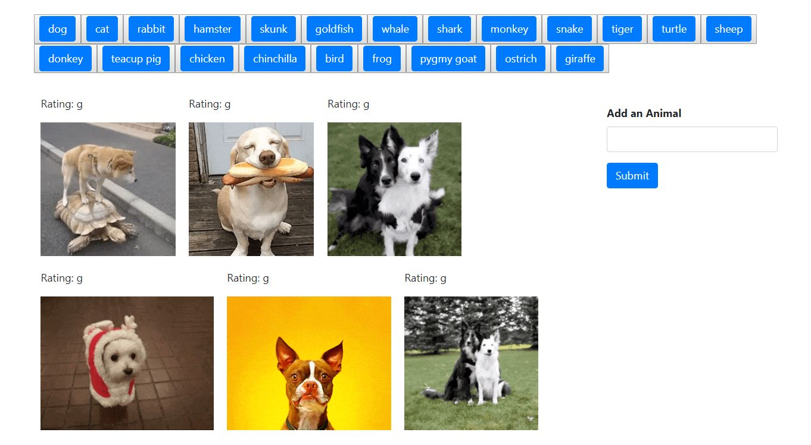

# Giftastic

Giftastic is a dynamic web page that populates with gifs of your choice. 
When the user clicks on a button, the page grabs 10 static, non-animated gif images from the GIPHY API and places them on the page. User has an option to add animals to his list by entering it in the input box.
When the user clicks one of the still GIPHY images, the gif should animate. If the user clicks the gif again, it stops playing.
Under every gif is displayed its rating (This data is provided by the GIPHY API).

Link to GitHub page: https://boki23m.github.io/Giftastic/

